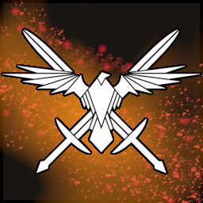

# Nebula
Nebula is a collection of utilities for adding various assets related to House of the Dying Sun.
# Building
This repo may require a change to where the game DLL is stored.
# Using as a library
Simply add the main DLL as a dependency, and any sub-DLLs you want to include as well. Read each project's ReadMe to learn more.
- [Nebula.Missions](Nebula.Missions/README.md)
- [Nebula.UI](Nebula.UI/README.md)