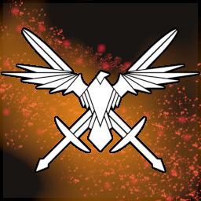

# Nebula
Nebula is a collection of utilities for adding various assets related to House of the Dying Sun, and provides a config menu for users.
# Building
Once the repository is cloned, a file named `Directory.Build.props` should be created at the root of the repo. Add the following text, replacing as needed:
```xml
<Project>
    <PropertyGroup>
        <!-- This is the full path to where the game is stored -->
        <GameDir>C:\Program Files (x86)\Steam\steamapps\common\DyingSun</GameDir>
    </PropertyGroup>
</Project>
```
# Using as a library
Simply add the main DLL as a dependency, and any sub-DLLs you want to include as well. Read each project's README and API to learn more on their usage.
- [Nebula](API.md)
- [Nebula.Missions](Nebula.Missions/README.md)
- [Nebula.UI](Nebula.UI/README.md)